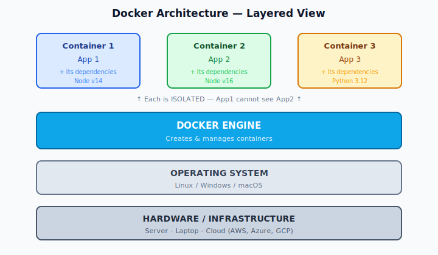
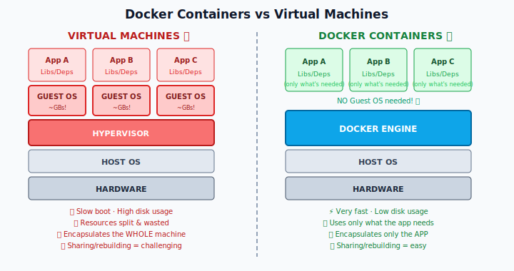
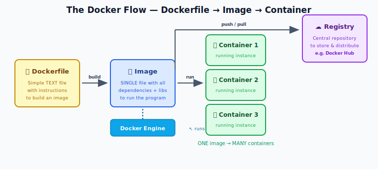
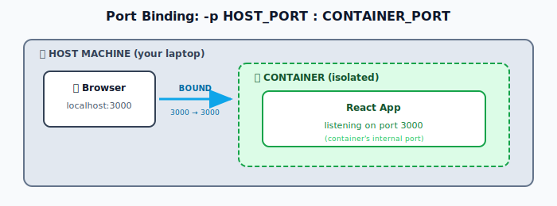
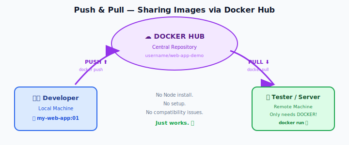
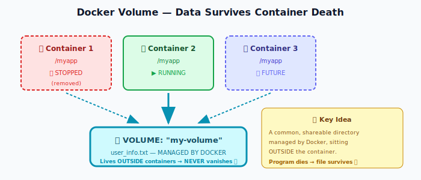
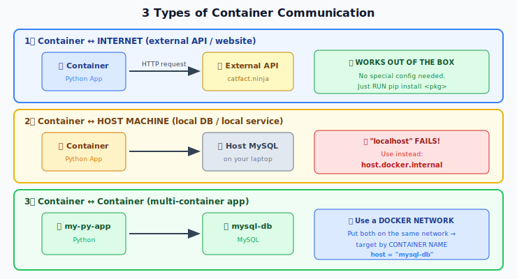
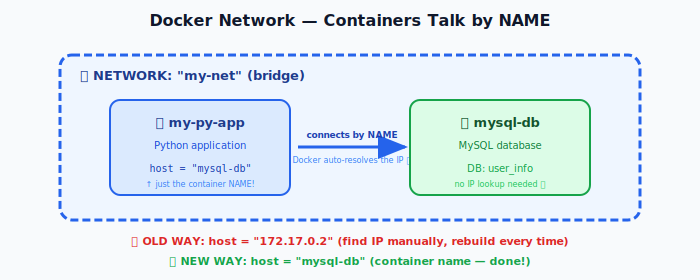

# 🐳 Docker — Complete Revision Notes (Basic → Advanced)
> Covers: fundamentals → installation → images → containers → volumes → networking → Docker Compose.
---

## 📑 Table of Contents

| # | Section |
|---|---------|
| 1 | [What is Docker?](#1-what-is-docker) |
| 2 | [Why Do We Need Docker? (The Core Problem)](#2-why-do-we-need-docker-the-core-problem) |
| 3 | [What is a Container?](#3-what-is-a-container) |
| 4 | [Docker Architecture](#4-docker-architecture) |
| 5 | [Docker vs Virtual Machines](#5-docker-vs-virtual-machines) |
| 6 | [Core Components of Docker](#6-core-components-of-docker) |
| 7 | [Installation](#7-installation) |
| 8 | [The Demo Project Setup](#8-the-demo-project-setup) |
| 9 | [Writing a Dockerfile](#9-writing-a-dockerfile) |
| 10 | [Building Images](#10-building-images) |
| 11 | [Running Containers](#11-running-containers) |
| 12 | [Port Binding](#12-port-binding) |
| 13 | [Detached Mode & Container Management](#13-detached-mode--container-management) |
| 14 | [Image Management & Tagging](#14-image-management--tagging) |
| 15 | [Updating Your App (Rebuild Workflow)](#15-updating-your-app-rebuild-workflow) |
| 16 | [Pre-defined Images & Docker Hub](#16-pre-defined-images--docker-hub) |
| 17 | [Interactive Mode](#17-interactive-mode--it) |
| 18 | [Docker Registry — Push & Pull](#18-docker-registry--push--pull) |
| 19 | [Docker Volumes (Data Persistence)](#19-docker-volumes-data-persistence) |
| 20 | [Bind Mounts](#20-bind-mounts) |
| 21 | [.dockerignore](#21-dockerignore) |
| 22 | [Container Communication](#22-container-communication) |
| 23 | [Docker Networks](#23-docker-networks) |
| 24 | [Docker Compose](#24-docker-compose) |
| 25 | [Command Cheat Sheet](#25-command-cheat-sheet) |
| 26 | [Interview Q&A](#26-interview-qa) |

---

## 1. What is Docker?

**Docker is a containerization platform** — a tool used to **create, manage, and run containers**.

It is extremely useful for developers because it helps at **every stage** of the software lifecycle:

```
Develop → Package → Ship → Run
```

**Key definition to memorize:**
> Docker provides the ability to run an application in an **isolated environment** called a **container**.

Because of Docker, the deployment and development process has become far more **efficient** and **easy** compared to before.

---

## 2. Why Do We Need Docker? (The Core Problem)

### 🔴 The Classic Scenario — "It works on my machine!"

A developer builds an application using several tools and services (Node.js, a database, etc.). They hand the code + instructions to the **testing team**. The tester tries to run it… and it **fails**.

The developer's famous reply:
> *"But it works on MY machine!"*

### Why does this happen? → **Compatibility Issues**

| Cause | Example |
|-------|---------|
| **OS differences** | Dev on macOS, Tester on Windows |
| **OS settings** | Different configurations |
| **Missing libraries** | A library installed on dev's machine only |
| **Missing dependencies** | Package not installed on tester's side |
| **Missing files** | A config file wasn't shared |
| **Missing environment variables** | `.env` not transferred |
| **Version mismatch** ⭐ | Dev tested on v1.2, tester has v1.0 |

### 🟢 The Docker Solution

With Docker, the developer:

1. Builds the application
2. Uses Docker to **package everything needed to run it**:
   - Application code
   - External services
   - Libraries
   - Dependencies
   - Config files
3. Delivers this **single package** to the testing team

Now the tester needs **only ONE thing**: **Docker**.
They simply extract & run the package — and it works. ✅

<div align="center">

```
BEFORE DOCKER                          AFTER DOCKER
─────────────                          ────────────
Dev machine  ✅ works                  Dev machine  ✅ works
    ↓ (code + instructions)                ↓ (one Docker image)
Test machine ❌ FAILS                  Test machine ✅ works
    ↑                                      ↑
compatibility hell                     only Docker needed
```

</div>

---

## 3. What is a Container?

### 🚢 Real-world analogy (this is where the name comes from)

Think of **shipping containers**:

- Goods are packed into a container and shipped from one place to another
- The **dock** (→ *Docker*) manages these containers
- If goods need a **cold environment**, that container maintains a low temperature internally
- **Each container is isolated** — one container's conditions do NOT affect another's

### 💻 In the software world

Exactly the same idea:

> **A container is a way to package an application with all its necessary dependencies and configuration.**

**Properties of a container:**

| Property | Meaning |
|----------|---------|
| ✅ **Isolated** | Runs in its own environment; other containers can't see it |
| ✅ **Easily shared** | Can be handed to anyone, anywhere |
| ✅ **Efficient** | Makes deployment & development fast |
| ✅ **Self-contained** | Everything needed to run the app lives inside |

---

## 4. Docker Architecture

Docker sits **between the OS and your applications**. Here's the layered view:



### 🔑 The Big Win from this architecture

By running apps inside containers, we **remove the app's direct dependency on the host operating system**.

**Result:** Transfer the container to another team or another server → **it still works**. No compatibility issues.

### 💡 Killer Use Case — Multiple Versions on One Machine

**Problem:** You have two apps on one computer:
- App 1 needs **Node.js v14**
- App 2 needs **Node.js v16**

How do you run both on the same server?

| Option | Cost |
|--------|------|
| ❌ Create 2 Virtual Machines | Heavy, wasteful, slow |
| ✅ **Create 2 Containers** | Lightweight, fast, isolated |

Since containers are isolated and have **no connection to each other**, App1's container runs Node 14 and App2's container runs Node 16 — **on the same machine, at the same time**. 🎉

---

## 5. Docker vs Virtual Machines



### 📊 Comparison Table

| Feature | 🐳 Docker Containers | 🖥️ Virtual Machines |
|---------|---------------------|---------------------|
| **Impact on OS** | Low | High |
| **Speed** | Very fast | Slow |
| **Disk space usage** | Low | High |
| **Resource usage** | Only what the app needs; rest stays **free & available** | Resources totally divided → **lots of waste** |
| **Sharing / Rebuilding / Distribution** | Easy | Really challenging |
| **What it encapsulates** | Just the **app + its dependencies** | The **entire machine** (incl. Guest OS) |
| **Guest OS required?** | ❌ No | ✅ Yes (per VM!) |

> **Verdict:** If your goal is to encapsulate *just the application*, **Docker containers are the better approach**.

---

## 6. Core Components of Docker

This single flow diagram explains **the entire Docker lifecycle** — memorize it:



### 📋 Definitions Table

| Component | Definition |
|-----------|------------|
| **📄 Dockerfile** | A simple **text file** containing **instructions to build an image** |
| **📦 Docker Image** | A **single file** with **all the dependencies and libraries** required to run the program. *(This is the "package" the developer sends to the tester!)* |
| **⚙️ Docker Engine** | The tool that **runs** the image |
| **🚢 Docker Container** | The **running instance / process** created when you run an image |
| **☁️ Docker Registry** | The **central repository** for **storing and distributing** images |

> ⭐ **Key insight:** You can run the **same image multiple times** → creating **multiple container instances**.

### 📁 Repository vs Registry

| Term | Meaning | Example |
|------|---------|---------|
| **Registry** | The whole common place / platform | Docker Hub |
| **Repository** | One collection inside the registry holding **different versions/tags of the SAME image** | The `node` repo (containing `node:18`, `node:20`, `node:21`…) |

### 🔓 Public vs Private Registry

| Type | Who uses it | Why |
|------|-------------|-----|
| **Public** (Docker Hub) | Everyone | 100,000+ container images already available (Node, MongoDB, Nginx, Python, MySQL…) |
| **Private** | Companies / Organizations | Their own applications **cannot be publicly exposed** — so they keep a private registry **within the company** |

---

## 7. Installation

### 🪟 Windows

**Requirements:**

| Requirement | Minimum |
|-------------|---------|
| **WSL** version | 1.1.3.0 or higher |
| **Windows** version | 21H2 or higher |
| **Processor** | 64-bit |
| **RAM** | At least 4 GB |
| **Virtualization** | Must be **Enabled** in BIOS |

**How to check WSL version:**
```bash
wsl --version
```

**How to check virtualization:**
Task Manager → **CPU** tab (left side) → look for **"Virtualization: Enabled"**
> ℹ️ On latest Windows versions this is **enabled by default**.

**Steps:**
1. Download **Docker Desktop** for Windows
2. Double-click the installer → check "Add shortcut to Desktop"
3. **⚠️ Restart required** after install
4. Accept the Service Agreement
5. Choose **Recommended settings** → Finish
6. Sign in to Docker Hub **or** click **"Continue without signing in"**

### 🍎 macOS

1. Download the `.dmg`
2. **Drag & drop** Docker into the **Applications** folder
3. Open via `Cmd + Space` → search "Docker"
4. Accept Terms & Service Agreement
5. Recommended settings → Finish
6. Enter your **system password** (required for making system changes)
7. Docker whale icon 🐳 appears in the **top menu bar**
   - Shows status: *"Docker Desktop is running"*
   - Has: Check for Updates, Settings, About Docker Desktop (see version)

### 🐧 Linux

Docker supports `.deb` and `.rpm` packages across: **Ubuntu, Debian, CentOS, Fedora, RHEL**.

> ⚠️ **Important architecture note:**
> - **Ubuntu** → supports **all architectures** (most versatile)
> - **RHEL (Red Hat)** → ⚠️ officially supports **ONLY `s390x`** (IBM Z architecture)!
>   `amd64` / `x86_64` are **NOT** supported — Red Hat has its own containerization tool: **Podman**
>   **Workaround:** Install the **CentOS package** on RHEL (CentOS is Red-Hat-based)

**RHEL / CentOS install (recommended: repository method):**

```bash
# 1. Check your architecture
uname -m

# 2. Install yum-utils
sudo yum install -y yum-utils

# 3. Add the Docker repository
sudo yum-config-manager --add-repo https://download.docker.com/linux/centos/docker-ce.repo

# 4. Install Docker Engine (latest)
sudo yum install docker-ce docker-ce-cli containerd.io \
     docker-buildx-plugin docker-compose-plugin

# 5. Start the Docker service
sudo systemctl start docker
sudo systemctl enable docker     # start on boot

# 6. Check status
sudo systemctl status docker      # should say: active (running)
```

### ✅ Verify Installation (any OS)

```bash
docker --version    # or  docker -v
docker ps           # list running containers
```

> 🔴 **CRITICAL:** Docker must be in a **RUNNING state** to use any command. On Windows/Mac, launch **Docker Desktop** first.

---

## 8. The Demo Project Setup

We need a sample app to practice on. The course uses a **React (Node.js) web app**.

> 💡 **Not a limitation!** You can use Java, Python, Go — anything. You just need *a simple application*.

```bash
# Verify Node is installed
node -v          # e.g. v20.x.x

# Create a React app  (⚠️ project name MUST be lowercase!)
npx create-react-app test-app

# Run it
cd test-app
npm start
```

Opens automatically at → **`http://localhost:3000`** (React's default port)
Stop it with → **`Ctrl + C`**

### 📂 Important files to know

| File / Folder | Purpose |
|---------------|---------|
| `package.json` | All dependencies + project info |
| `src/App.js` | The **main file** — the web page you see |
| `node_modules/` | ⭐ **All the packages needed to run the project** |

### ⚠️ The `node_modules` Lesson (very important for Docker!)

```bash
# Delete node_modules, then try:
npm start
# ❌ ERROR: command not found

# Fix it:
npm install      # ← node_modules comes back!
npm start        # ✅ works
```

**Why does this matter?**
`node_modules` is **HUGE**. We do **not** ship it during deployment. Instead we ship only the main files and run **`npm install`** on the target to regenerate it.

> 🎯 **This is exactly why our Dockerfile will contain `RUN npm install`.**

---

## 9. Writing a Dockerfile

> **Dockerfile = a simple text file with instructions to build an image.**

Create a file named exactly **`Dockerfile`** (no extension) in your project folder.

> 💡 **Tip:** Install the **Docker extension** in VS Code — you get autocomplete + hints while writing.

### 📝 Complete Dockerfile (React app)

```dockerfile
# 1️⃣ BASE IMAGE — what our app needs to run
FROM node:20

# 2️⃣ WORKING DIRECTORY — create a folder INSIDE the container
WORKDIR /myapp

# 3️⃣ COPY — copy all files from current dir → working dir
COPY . .

# 4️⃣ RUN — executed at BUILD time (creating the image)
RUN npm install

# 5️⃣ EXPOSE — document the port (optional)
EXPOSE 3000

# 6️⃣ CMD — executed at RUN time (when the container starts)
CMD ["npm", "start"]
```

### 🔍 Instruction-by-Instruction Breakdown

| Instruction | What it does | Key notes |
|-------------|--------------|-----------|
| **`FROM node:20`** | The **base image** | `node` = image name, `20` = version. **If you omit the version → it uses `latest`.** This image is pulled from **Docker Hub**. |
| **`WORKDIR /myapp`** | Creates a folder inside the (empty) container and sets it as the working directory | Visualize: the container is an **empty isolated environment** — we make a room inside it for our app |
| **`COPY . .`** | Copy **everything** from the current directory → into the working directory | First `.` = source (host), second `.` = destination (container). *You could also write `COPY . /myapp`* |
| **`RUN npm install`** | Runs at **BUILD time** | ⭐ **Why?** Because we deleted `node_modules`! The container needs it, so we regenerate it *while building the image* → the image becomes a **complete package** |
| **`EXPOSE 3000`** | Documents which port the app listens on | **Optional** — it does NOT actually publish the port |
| **`CMD ["npm", "start"]`** | Runs at **RUN time** (container start) | ⚠️ **Array/JSON format!** Each word in its own quotes, comma-separated |

### ⚔️ `RUN` vs `CMD` — The #1 Confusion

```
  RUN  ────────►  Executes while BUILDING the image
                  (npm install → bake dependencies in)

  CMD  ────────►  Executes when RUNNING the container
                  (npm start → actually launch the app)
```

> **Remember:** We're only *building an image* right now — we don't want to *run* the app during the build. That's why `npm start` goes in `CMD`, not `RUN`.

---

## 10. Building Images

```bash
docker build .
```

The **`.`** means: *"the Dockerfile is present in the current directory."*

> 😅 **Common silly mistake:** `Dockerfile cannot be empty`
> → You forgot to **SAVE** the Dockerfile! Press `Ctrl + S` and rebuild.

### Watch the build steps

Docker will show each step:
1. Pull the `node:20` base image
2. Create the `/myapp` folder
3. Copy files
4. Run `npm install`
5. …

**Output:** `writing image sha256:...` → a long **Image ID**.

### List your images

```bash
docker image ls
# or
docker images
```

| Column | Meaning |
|--------|---------|
| REPOSITORY | Image name |
| TAG | Version |
| IMAGE ID | Short unique hash |
| CREATED | When built |
| SIZE | ⚠️ Often large (~GB) because it includes Node + all packages |

---

## 11. Running Containers

```bash
# Get the image ID first
docker image ls

# Run it
docker run <IMAGE_ID>
```

### 🤔 Why is my terminal STUCK?

Your console freezes / hangs. **This is normal!**

> Our app isn't a small script that finishes and exits — it's a **website that keeps running forever**, waiting for requests. It's running in the **foreground**.

### ❌ Problem: `localhost:3000` → "Site can't be reached"

**Why?** Visualize what happened:

```
   Your Laptop (Host Machine)
   ┌────────────────────────────────────┐
   │                                    │
   │   Browser ──────✗ BLOCKED          │
   │                    │               │
   │   ┌────────────────▼─────────────┐ │
   │   │   CONTAINER (isolated!)      │ │
   │   │                              │ │
   │   │   App listening on :3000  ✅ │ │
   │   │   (accessible INSIDE only)   │ │
   │   └──────────────────────────────┘ │
   └────────────────────────────────────┘
```

The app **IS** running on port 3000 — but **inside the container's isolated environment**. Your host browser can't reach it. ➡️ **We need PORT BINDING.**

### 🛑 First, stop the running container

Open a **second terminal**:

```bash
docker ps                    # see running containers
docker stop <CONTAINER_NAME> # stop it
docker ps                    # verify — now empty
```

> 🎲 **Fun fact:** Docker auto-assigns **random names** to containers (e.g. `dreamy_wiles`). You'll see a new quirky name every time!

---

## 12. Port Binding

```bash
docker run -p 3000:3000 <IMAGE_ID>
```



### 📐 Syntax

```
docker run -p <HOST_PORT>:<CONTAINER_PORT> <IMAGE>
              ↑              ↑
        outside access   inside the container
```

Now visit `http://localhost:3000` → **✅ Your app appears!**

---

## 13. Detached Mode & Container Management

### 🎯 Problem: Foreground blocks the terminal

Running a container normally **hangs your console**. You can't run other commands or manage multiple containers.

### ✅ Solution: `-d` = Detached Mode (background)

```bash
docker run -d -p 3000:3000 <IMAGE_ID>
```

**Result:** Docker prints a process ID and **frees your terminal** immediately. 🎉

```bash
docker ps    # verify: "Up 16 seconds"
```

### 🏷️ Naming your containers

```bash
docker run -d --rm -p 3000:3000 --name "my-web-app" <IMAGE_ID>
```

**Why bother?**
1. You **remember** it (vs. random `dreamy_wiles`)
2. Managing it becomes easy → `docker stop my-web-app`

### 🧹 Auto-cleanup with `--rm`

**Problem:** Every stopped container still **exists** in the background. You must manually `docker rm` them. Tedious!

**Solution:**

```bash
docker run -d --rm -p 3000:3000 <IMAGE_ID>
```

> **`--rm`** = *"when this container stops, **automatically remove it**"* → saves you an extra step.

```bash
docker stop <name>
docker ps -a          # ✅ EMPTY — stopped AND removed in one step!
```

### 📋 Container Management Commands

```bash
docker ps                     # RUNNING containers only
docker ps -a                  # ALL containers (running + stopped + created)
docker stop <name|id>         # stop a container
docker start <name|id>        # restart a stopped container
docker rm <name1> <name2>     # remove container(s) — can pass multiple!
docker logs <name>            # 🔍 see WHY a container crashed
docker inspect <name>         # full details (incl. IP address!)
```

> ⚠️ **`docker ps` vs `docker ps -a`:** `ps` shows only **running**. If Docker Desktop shows many containers but `docker ps` shows one — use **`docker ps -a`** to see them all (Created / Exited / Running states).

### 🖥️ Docker Desktop (GUI bonus)

If you're on Windows/Mac, the GUI makes life easier:
- See **all containers** and their states
- **Restart** stopped containers with one click
- **Delete** containers easily
- View **CPU usage, Memory usage** → acts as a quick **monitoring tool**

---

## 14. Image Management & Tagging

### 😖 The problem with Image IDs

Would you tell a teammate *"use image `2f02e...`"*? **Terrible.** Let's give images **meaningful names**.

### 🏷️ Tagging: `-t`

```bash
docker build -t my-web-app:01 .
             ↑   ↑          ↑  ↑
             │   name    version │
             │                Dockerfile location
          "-t" = TAG
```

**Format:** `name:version` — exactly like `node:20` (name `node`, version `20`)!

```bash
docker image ls
# REPOSITORY    TAG   IMAGE ID
# my-web-app    01    2f02e8b...   ← same ID, nice name ✅
```

### 🗑️ Deleting images

```bash
docker rmi my-web-app:02     # rmi = ReMove Image
```

| Command | Removes |
|---------|---------|
| `docker rm` | **Container** |
| `docker rmi` | **Image** |

> 💡 With `rmi` you don't need the Image ID — **just use the name:tag**.

### 🔄 Renaming an existing image

```bash
docker tag my-web-app:02 username/web-app-demo:02
#          ↑ OLD name              ↑ NEW name
```

---

## 15. Updating Your App (Rebuild Workflow)

**Scenario:** You fixed a bug / added a feature / made a correction in your source code.

### ⭐ Golden Rule

> **If only your SOURCE CODE changes → you do NOT need to change the Dockerfile.**
> Just **rebuild** the image.

```bash
# 1. Edit your code (e.g. src/App.js)
# 2. SAVE it! ⚠️
# 3. Rebuild with a NEW version tag
docker build -t my-web-app:02 .

# 4. Check
docker image ls
# my-web-app   02   <NEW UNIQUE IMAGE ID>   ← different ID! ✅
# my-web-app   01   <old id>

# 5. Run the new version
docker run -d --rm --name my-web-app -p 3001:3000 my-web-app:02
```

> 💡 Notice: instead of the Image ID, we can now use the **`name:tag`** — much nicer!

### 🎁 HUGE Benefit: Run Multiple Versions Side-by-Side!

```bash
# New version on port 3001
docker run -d --rm --name my-web-app -p 3001:3000 my-web-app:02

# OLD version on port 3002   (different port + different name!)
docker run -d --rm --name my-web-app-01 -p 3002:3000 my-web-app:01
```

Now open **two browser tabs**:
- `localhost:3001` → new content ✨
- `localhost:3002` → old content

> ✅ **Compare / verify changes side-by-side.** This is the beauty of containerization!

### 🚫 Common Errors

| Error | Cause | Fix |
|-------|-------|-----|
| `port is already allocated` | Port 3000 already in use by another container | Use a different **host** port (`-p 3001:3000`) |
| `container name already in use` | You reused a `--name` | Give a unique name |

### 🔬 Proof of Isolation (Interview Favorite!)

```bash
docker run -d --rm -p 3000:3000    # ✅
docker run -d --rm -p 3001:3000    # ✅
docker run -d --rm -p 3002:3000    # ✅

docker ps
```

**All three containers listen on port 3000 internally!** How?!

> 💡 **Because they're ISOLATED.** Each listens on 3000 *inside its own container*. Container A has **nothing to do with** Container B. They don't affect each other. Only the **host** ports (3000/3001/3002) must differ.
>
> This is a **kind of load balancing** — and a great answer if asked in interviews! 🎯

---

## 16. Pre-defined Images & Docker Hub

So far we built **custom images** (our own). Now: **pre-defined images**.

### ☁️ Docker Hub → `hub.docker.com`

> *"Build and Ship any Application Anywhere"*

- **100,000+ container images already available**
- Publicly available — **you don't need to build them**
- Popular companies/software publish their own official images

**Common pre-defined images:** `node` · `python` · `mysql` · `postgres` · `mongodb` · `nginx` · `apache` · `redis`

Each image (e.g. `python`) has **many versions/tags**: `3.13`, `3.12`, `3.11`, `3.8`…

### ⬇️ Pulling an image

```bash
docker pull python           # no version → pulls "latest"
docker pull python:3.12      # specific version
docker image ls              # verify
```

### ⚠️ Not every image "runs" visibly

```bash
docker run python:latest
docker ps          # ...nothing! It ran and exited immediately.
```

**Why?** Python alone has nothing to *do* — no long-running process.

### ✅ Try Nginx instead (a real web server)

**What is Nginx?** A **web server**. It runs continuously in the background, **waiting for incoming requests from browsers**. When a browser requests a page, Nginx accepts the request and serves the web page.

> 🔑 **Nginx listens on port 80 by default** (our React app used 3000).

```bash
docker pull nginx
docker run -p 8080:80 nginx:latest
```

Open `http://localhost:8080` → **"Welcome to nginx!"** ✅

Watch the console — it **keeps running continuously**, logging every request.

---

## 17. Interactive Mode (`-it`)

**Scenario:** Your program **takes user input** (e.g. a Python script asking for two numbers).

### 🐍 Example program

```python
# my_app.py
print("Program to sum two numbers")
num1 = int(input("Enter the first number: "))
num2 = int(input("Enter the second number: "))
print("Sum of two numbers is", num1 + num2)
```

### Dockerfile

```dockerfile
FROM python
WORKDIR /myapp
COPY my_app.py .
CMD ["python", "my_app.py"]
```

### ❌ Running normally FAILS

```bash
docker build .
docker run <IMAGE_ID>

# Output:
# Program to sum two numbers
# Enter the first number:      ← 💥 program stops/fails here!
```

**Why?** The container has **no interactive terminal** — it can't accept your keyboard input.

### ✅ Fix: `-it`

```bash
docker run -it <IMAGE_ID>
```

> 🧠 **Memory trick:** **`-it`** = **I**nteractive **T**erminal

Now:
```
Program to sum two numbers
Enter the first number: 10        ← you CAN type! ✅
Enter the second number: 20
Sum of two numbers is 30
```
Once the program finishes → the **container stops automatically**.

---

## 18. Docker Registry — Push & Pull

**Goal:** Share our image with teammates / another server / the world.



### 💰 Docker Hub Pricing (Free tier — $0)

| Feature | Free tier |
|---------|-----------|
| **Public repositories** | ♾️ **Unlimited** — anyone in the world can download & use |
| **Private repositories** | **1** — only you + your authorized team members |
| **Good for** | Education, individual developers, open-source community |

### 📝 Step-by-Step: Push your image

**1️⃣ Create a repository on Docker Hub**
- Sign up → verify email
- Click **Create a Repository**
- Name: `web-app-demo` · Description: `docker learning`
- Visibility: **Public** (nothing sensitive here)

Your image name becomes: **`<username>/web-app-demo`**

**2️⃣ Login from terminal**

```bash
docker login
# Enter Docker ID + password
# → "Login Succeeded" ✅
```
> Login is needed because you're pushing into **your** space on Docker Hub.

**3️⃣ Build with the CORRECT name**

```bash
docker push <username>/web-app-demo:01
# ❌ ERROR: "An image does not exist locally"
```

> ⚠️ **Why the error?** The image name **must exactly match** `<username>/<repo-name>`! Our local image is called `my-web-app` — that's not the same thing.

**Two ways to fix:**

```bash
# Option A: Rebuild with the right name
docker build -t <username>/web-app-demo:01 .

# Option B: Rename the EXISTING image (faster!)
docker tag my-web-app:02 <username>/web-app-demo:02
```

**4️⃣ Push!**

```bash
docker push <username>/web-app-demo:01
```

Refresh Docker Hub → your image appears under the **Tags** tab. 🎉

### 🧠 Smart Docker: "Layer already exists"

When pushing v2 after v1, you'll see: **`Layer already exists`**.

> Docker is **smart** — it doesn't re-store things that already exist. It **links** to existing layers instead. This **preserves & optimizes storage space**.

### ⬇️ Pull on a brand-new machine

```bash
docker pull <username>/web-app-demo:02
docker images
docker run -p 3000:3000 <username>/web-app-demo:02
```

Open `localhost:3000` → **your app runs on a completely different machine!** 🚀

> ✅ **No Node.js install. No setup. No configuration.** Just install Docker → pull → run.
> **Deployment in minimal time with minimal effort. Compatibility issues → nearly zero.**

---

## 19. Docker Volumes (Data Persistence)

### 🔴 The Problem: Data Disappears!

**Scenario:** A Python program that saves usernames into a file.

```python
# my_app.py
user_name = input("Enter your name to store in a file (or Enter to proceed): ")

if user_name:
    file = open("user_info.txt", "a")   # "a" = APPEND
    file.write(user_name + "\n")
    file.close()

show = input("Do you want to see all user names in the file? (y/n): ")
if show == "y":
    file = open("user_info.txt", "r")   # "r" = READ
    for line in file:
        print(line)
```

**Running it LOCALLY (physical machine):**

| Run | Input | Output |
|-----|-------|--------|
| 1st | `Paul` | Paul |
| 2nd | `Raju` | Paul, **Raju** ✅ |
| 3rd | `Shyam` | Paul, Raju, **Shyam** ✅ |

**Data persists!** ✅ (The `user_info.txt` file survives between runs.)

### ❌ Now run it in a CONTAINER…

```bash
docker build .
docker run -it --rm <IMAGE_ID>
```

| Run | Input | Output |
|-----|-------|--------|
| 1st | `Shyam` | Shyam |
| 2nd | `Raju` | **Raju only!** ❌ Where did Shyam go?! |

### 💡 Why?

```
Container starts  →  file created INSIDE container
Container stops   →  💥 container removed (--rm)
                     💥 THE FILE IS GONE TOO!

"No container remains, no file remains."
```

The file lives **inside the container's isolated filesystem**. When the container dies, **the data dies with it**.

### ✅ Solution: Docker Volumes



### 🛠️ Syntax

```bash
docker run -it --rm -v my-volume:/myapp <IMAGE_ID>
                    ↑  ↑          ↑
                    │  │          └── path INSIDE the container
                    │  └───────────── volume name (your choice)
                  "-v" = VOLUME
```

> ⚠️ **CRITICAL:** The path after `:` **must match the path inside the container where your file is created**.
> Our Dockerfile has `WORKDIR /myapp` → our Python program runs there → the file is generated there → so we mount `/myapp`.

### ✅ Result

| Run | Input | Output |
|-----|-------|--------|
| 1st | `Raju` | Raju |
| 2nd | `Shyam` | Raju, **Shyam** ✅ |
| 3rd | `Baburao` | Raju, Shyam, **Baburao** ✅ |

**Data persists across container restarts!** 🎉

### 📋 Volume Commands

```bash
docker volume --help          # 💡 see ALL options for any command!
docker volume ls              # list volumes
docker volume inspect <name>  # details: driver, created-at, scope, MOUNT POINT
docker volume rm <name>       # delete a volume
```

Example `docker volume ls` output:
```
DRIVER    VOLUME NAME
local     my-volume        ← "local" = present locally, Docker handles it
```

---

## 20. Bind Mounts

### 🎯 Different problem, different tool

**Scenario:** Your program **depends on an external file** that YOU want to edit from your physical machine.

```python
# reads a list of servers from a file
file = open("servers.txt", "r")
for line in file:
    print(line)
```

`servers.txt` (on your physical machine):
```
server1
server2
server3
```

### 🤔 The problem

Once this is inside a container, **you cannot edit that file** — it's locked inside the container's isolated environment. Every code change would mean **rebuilding the image**. Painful.

### ✅ Solution: Bind Mount

**Link (bind) a file/folder on your PHYSICAL machine ↔ a file/folder INSIDE the container.**
Edit locally → the change is **instantly visible** in the container. 🔥

### 🛠️ Syntax

```bash
docker run -it --rm -v ./servers.txt:/myapp/servers.txt <IMAGE_ID>
                    ↑  ↑                ↑
                    │  │                └── path INSIDE container
                    │  └─────────────────── path on PHYSICAL machine
                    │                        (relative OR absolute)
                  "-v" again!
```

> 💡 **Read it as:** `HOST_PATH : CONTAINER_PATH`
> You can bind a **specific file** (as above) or an **entire folder**.

### ✅ Live demo result

```
Run 1  →  server1, server2, server3, server4
   ↓  (edit servers.txt locally, add "server5", SAVE)
Run 2  →  server1 ... server4, server5   ✅ LIVE UPDATE — no rebuild!
```

### 🎯 Two great use cases for Bind Mounts

1. **📄 Code depends on an external/config file** → keep it editable on the host
2. **👨‍💻 During the DEVELOPMENT phase** → you're constantly changing code.
   > **Without bind mounts:** every tiny change = rebuild the image. 😩
   > **With bind mounts:** build once, mount your local files → **changes reflect instantly** → verify → build the **final image** at the end. 🎉

### ⚔️ Volumes vs Bind Mounts

| | 💾 **Volume** | 🔗 **Bind Mount** |
|---|---|---|
| **Syntax** | `-v my-volume:/myapp` | `-v ./file.txt:/myapp/file.txt` |
| **Managed by** | **Docker** | **You** (it's your physical filesystem) |
| **Shows in `docker volume ls`** | ✅ Yes | ❌ **No** (no volume is created!) |
| **Use for** | **Persisting data** the app generates | **Live-editing** files during development |
| **Location** | Docker's internal storage | Anywhere on your machine |

> 🔑 **Key check:** After a bind mount, run `docker volume ls` → **nothing there**. Because we mounted a **physical location**, no Docker volume was needed!

---

## 21. `.dockerignore`

Just like **`.gitignore`** — but for Docker.

### 🤔 The problem

Your Dockerfile has `COPY . .` → **EVERY file** in the project gets copied into the image, including:
- `Dockerfile` itself (you need it, but not *inside* the image!)
- `.gitignore`
- `.git/` folder
- Other junk you don't want bloating your image

### ✅ Solution

Create a file called **`.dockerignore`** in the same location where you build the image:

```dockerignore
# Exact file names
Dockerfile
.gitignore
README.md

# Wildcard patterns
.git*
node_modules
*.log
```

Now `docker build` → **these files will NOT go into your image.** ✅

---

## 22. Container Communication

Your containerized app doesn't live alone. **Three types of communication:**



---

### 1️⃣ Container → Internet / External API ✅ (Easiest)

**Example:** A Python app fetching a random cat fact from an API.

```python
import requests
url = "https://catfact.ninja/fact"
response = requests.get(url)
print(response.json()["fact"])
```

**❌ First attempt fails:**
```
ModuleNotFoundError: No module named 'requests'
```

**Why?** `requests` is an **external package** — **not part of Python by default**. The container doesn't have it!

**✅ Fix — add a `RUN` step to the Dockerfile:**

```dockerfile
FROM python
WORKDIR /myapp
COPY api_demo.py .
RUN pip install requests          # ⭐ install the external package
CMD ["python", "api_demo.py"]
```

Rebuild → run → **random cat fact prints!** 🐱 API communication works perfectly.

> 🎓 **Lesson learned:** Whenever your Python code `import`s an **external package**, you need an **additional `RUN pip install <package>`** step in the Dockerfile.

---

### 2️⃣ Container → Host Machine (Local Database) ⚠️

**Example:** Python app connecting to **MySQL running on your physical machine**.

```python
import mysql.connector

def create_connection():
    return mysql.connector.connect(
        host="localhost",       # ← ❌ THIS IS THE PROBLEM
        user="root",
        password="root",
        database="user_info"
    )
```

**Dockerfile:**
```dockerfile
FROM python
WORKDIR /myapp
COPY sql_demo.py .
RUN pip install mysql-connector-python
CMD ["python", "sql_demo.py"]
```

**❌ Running it:**
```
Can't connect to MySQL server on 'localhost'
Cannot assign requested address
```

### 💡 Why does `localhost` fail?

> Inside the container, **`localhost` means THE CONTAINER ITSELF** — not your laptop!
> The container is an isolated environment with **no relation to the host OS**. How would it know what "localhost" means to *you*, or where your database lives?

### ✅ The Fix — ONE word change!

```python
host="host.docker.internal"     # ✅ instead of "localhost"
```

> 🔑 **`host.docker.internal`** tells Docker: *"target the **HOST MACHINE** where Docker is installed."*

Rebuild → run → **✅ Connected!** Now you can `INSERT` and `SELECT` from the container, and see the changes **live in your local MySQL Workbench**. 🔥

---

### 3️⃣ Container → Container (see next section 👇)

---

## 23. Docker Networks

**Scenario:** Both the Python app **AND** MySQL run in **separate containers**.

### 😖 The Painful Way (without a network)

```bash
# 1. Pull & run MySQL container FIRST
docker pull mysql
docker run -d --name mysql-db \
  -e MYSQL_ROOT_PASSWORD=root \
  -e MYSQL_DATABASE=user_info \
  mysql
```

> ⚠️ **Without `-e MYSQL_ROOT_PASSWORD`, the container immediately STOPS!**
> Use `docker logs mysql-db` to find out why → *"You need to specify one of the following environment variables…"*

| Environment Variable | Purpose |
|---------------------|---------|
| `MYSQL_ROOT_PASSWORD` | **Required.** Sets the root password |
| `MYSQL_DATABASE` | Auto-creates a database **when the image starts up** |

```bash
# 2. Find the container's IP address 😩
docker inspect mysql-db
# → Networks → IPAddress: 172.17.0.2

# 3. Hardcode that IP into your Python code
host = "172.17.0.2"

# 4. NOW build the Python image
docker build .
```

### 🔴 What's wrong with this?

> **To build the Python image, I must FIRST build and run MySQL, then look up its IP.** Every. Single. Time.
>
> That's backwards! Images should be **ready to go** — we should only need to change the **command**, not rebuild.

### ✅ The Solution: Docker Network



### 🛠️ Commands

```bash
# 1. Create a network
docker network create my-net

# 2. Verify
docker network ls
# NAME     DRIVER
# my-net   bridge          ← "bridge" type network created ✅

# 3. Run MySQL ON that network
docker run -d --name mysql-db --network my-net \
  -e MYSQL_ROOT_PASSWORD=root \
  -e MYSQL_DATABASE=user_info \
  mysql

# 4. In your Python code — use the CONTAINER NAME as host!
#    host = "mysql-db"

# 5. Build & run Python ON THE SAME network
docker build .
docker run -it --rm --network my-net <IMAGE_ID>
```

### 🎉 The Magic

> Because both containers are on the **same network**, Docker **automatically resolves the container name → target IP** for you.
>
> **You never need to look up an IP again!** Just remember your container's **name**.

### 🚨 Bonus: A `cryptography` error?

When connecting Python → MySQL you may hit:
```
RuntimeError: ... cryptography package is required ...
```

**Why?** It's needed for **authentication & connection with the database**.

**Fix:**
```dockerfile
RUN pip install mysql-connector-python
RUN pip install cryptography        # ⭐ add this
```

### 💾 Data persistence in the MySQL container

```bash
docker stop mysql-db     # container stops (but still EXISTS — "Exited" state)
docker start mysql-db    # bring it back up
```

> ✅ **The data is STILL THERE!** As long as you don't **remove** (`docker rm`) the container, your data is **preserved**.

---

## 24. Docker Compose

### 📖 Definition

> **Docker Compose is a config file (based on YAML) used to manage your containers.**

Officially it says *"to manage multiple containers"* — but **there's no such limitation**: you can use it for a **single container** too. It just shines brightest with **many** containers.

### 😩 The Problem It Solves

Look at the command we needed for a **single** MySQL container:

```bash
docker run -d --name mysql-db --network my-net \
  -e MYSQL_ROOT_PASSWORD=root \
  -e MYSQL_DATABASE=user_info \
  -v my-volume:/var/lib/mysql \
  mysql:latest
```

That's a **3-4 line monster**. And we haven't even added volumes and mounts for the *other* containers!

**Why is this bad?**
- ❌ You must **retype the same huge command** repeatedly
- ❌ Working in a **team**? Your teammate must type the **entire thing** too
- ❌ Repetitive → **error-prone** → **not an efficient way** to work

**➡️ Docker Compose solves exactly this.**

### 📄 File name

Create: **`docker-compose.yml`** (or `.yaml`)

> 💡 **Tip:** Install a **Docker Compose plugin/extension** in your editor (VS Code / PyCharm) → you get **autocomplete + auto-formatting**. Life gets much easier.

### 🧱 Basic Structure — Single Service

```yaml
services:                        # ⭐ REQUIRED — the main section
  mysql-db:                      # service name (your choice)
    image: mysql:latest          # which image to use
    container_name: mysql-db     # optional (Docker auto-names otherwise)
    environment:
      - MYSQL_ROOT_PASSWORD=root
      - MYSQL_DATABASE=user_info
```

> ⚠️ **Syntax gotcha:** environment variable values take **NO double quotes**! Check the docs — `MYSQL_ROOT_PASSWORD=root`, not `"root"`.

### ▶️ Running it

```bash
docker compose up          # build/pull + start everything
docker compose up -d       # detached (background) mode
docker compose down        # stop AND remove containers
```

> 📍 **Location matters:** Run the command from the folder where `docker-compose.yml` lives.

### ✨ What `up` does automatically

1. **Pulls** the image (if not present)
2. **Runs** the container
3. **Applies** all your environment variables, names, ports…

### ✨ What `down` does automatically

```
Stopping mysql-db ...
Removing mysql-db ...
Removing network ...
```

> 🎉 It **stops AND removes** the container → you **don't need `--rm`** anymore!

---

### 🧱 Multiple Services (Python + MySQL)

> ⚠️ **IMPORTANT:** **Docker Compose does NOT replace your Dockerfile!**
> When you build **custom images**, you still need the Dockerfile. Compose just adds a `build:` step.

```yaml
services:

  # ───── SERVICE 1: MySQL (pre-defined image) ─────
  mysql-db:
    image: mysql:latest
    container_name: mysql-db
    environment:
      - MYSQL_ROOT_PASSWORD=root
      - MYSQL_DATABASE=user_info
    healthcheck:                                  # ⭐ see below!
      test: ["CMD", "mysqladmin", "ping", "-h", "localhost"]
      timeout: 20s
      retries: 10

  # ───── SERVICE 2: Python (custom image) ─────
  my-python-app:
    build: ./                                     # ⭐ path to the Dockerfile
    container_name: my-py-app
    stdin_open: true                              # ⭐ = the "-i" flag
    tty: true                                     # ⭐ = the "-t" flag
    depends_on:
      mysql-db:
        condition: service_healthy                # ⭐ wait until HEALTHY
```

### 🔑 Key Directives Explained

| Directive | Equivalent CLI flag | Purpose |
|-----------|--------------------|---------|
| `image:` | `docker run <image>` | Use a **pre-defined** image |
| `build: ./` | `docker build .` | Build a **custom** image from a Dockerfile. **Relative paths allowed!** (`./app/` if the Dockerfile is in a subfolder) |
| `container_name:` | `--name` | Name the container |
| `environment:` | `-e` | Set environment variables |
| `ports:` | `-p` | Port binding (`- 8080:3000`) |
| `volumes:` | `-v` | Volumes & bind mounts |
| `networks:` | `--network` | Attach to a network |
| `stdin_open: true` | `-i` | Keep STDIN open |
| `tty: true` | `-t` | Allocate a terminal |
| `depends_on:` | *(none!)* | Start order + wait conditions |
| `healthcheck:` | *(none!)* | Check if a service is actually **ready** |

---

### 🐛 The Race Condition Bug (VERY Important!)

**Symptom:** You run `docker compose up` and the Python container **crashes**:
```
Can't connect to MySQL server on 'mysql-db'
```
…even though the config is perfect!

### 💡 Why?

```
Compose starts BOTH containers together
        │
        ├─► MySQL:  starts... loading... loading... (SLOW! ~20s)
        │
        └─► Python: starts instantly → tries to connect → 💥 MySQL isn't ready yet!
```

> **MySQL takes time to come up.** Python arrives in between and tries to connect — but MySQL isn't **ready for connections** yet.

### ❌ Attempt 1: `depends_on` alone — NOT ENOUGH!

```yaml
depends_on:
  - mysql-db          # ← only waits for the container to START
```

**Still fails!** Why?

> 🔑 **"Container is UP" ≠ "Ready for connections"!**
> `depends_on` alone only knows the container *started*. It has no idea whether MySQL is actually **accepting connections**.

### ✅ Attempt 2: `healthcheck` + `depends_on: condition` = WORKS! 🎉

```yaml
mysql-db:
  image: mysql:latest
  healthcheck:
    test: ["CMD", "mysqladmin", "ping", "-h", "localhost"]
    timeout: 20s        # keep trying for 20 seconds
    retries: 10         # retry 10 times if it fails

my-python-app:
  build: ./
  depends_on:
    mysql-db:
      condition: service_healthy      # ⭐ wait for HEALTHY, not just "started"
```

**What `healthcheck` does:**
> *"Declares a check that runs to determine whether or not the service containers are **healthy**."*

It literally **tries to connect** via command line (`mysqladmin ping`). Once the connection succeeds → the health status flips to **healthy** → **only then** does Python start. ✅

**Result:** After ~20 seconds → MySQL becomes **"ready for connections"** → Python launches → **connects successfully!** 🎉

---

### ▶️ Running a SINGLE service from Compose

Sometimes you want interactive mode for just one container:

```bash
# Start MySQL in the background
docker compose run -d mysql-db

# Now run the Python app interactively (foreground)
docker compose run my-python-app
```

> Use the **service name** from your YAML file. Now you get a working **interactive terminal**! ✅

---

### 🌐 The Auto-Network Superpower ⭐⭐⭐

**Question:** In our Compose file, our Python code says `host = "mysql-db"` (a container name). But we **never created a network**! How do they connect?!

### 💡 Answer

> **All services inside a SINGLE `docker-compose.yml` file automatically become part of ONE network.**
> Docker Compose **creates the network by itself** and **adds all services to it**.
>
> ➡️ **You don't need to create a network manually!**

**Proof:**
```bash
docker network ls
# NAME                            DRIVER
# python-demo-project_default     bridge     ← 🎉 Compose made this automatically!
#     ↑ folder name + "_default"
```

**Live proof:** Delete that network → run `docker compose up` again → **Compose recreates it automatically!** ✨

### 🛠️ Defining your OWN network (optional)

```yaml
services:
  mysql-db:
    image: mysql:latest
    networks:                    # ← attach the service
      - my-network

  my-python-app:
    build: ./
    networks:                    # ← attach this one too
      - my-network

networks:                        # ← top-level section (same indent as "services")
  my-network:                    # ← define it here
```

> 📝 Compose adds a **prefix**: `python-demo-project_my-network`

---

### 🧹 Cleanup: `down` vs `down -v`

```bash
docker compose down       # stops + removes CONTAINERS only
                          # ⚠️ networks & volumes STAY

docker compose down -v    # ⭐ ALSO removes networks & volumes
                          # → "Removing network ..." ✅
```

### 🔨 Force rebuild

> ⚠️ On the **first** run, Compose builds/pulls images. On **subsequent** runs, it **reuses the old image** — even if your code changed!

```bash
docker compose up --build     # ⭐ force a rebuild
```

---

### 🧾 Full Example: Web App with Compose

```yaml
services:
  my-web-app:
    build: ./                    # Dockerfile in same folder
    container_name: my-web-app
    ports:
      - 8080:3000                # host:container  (3000 = React default)
```

```bash
docker compose up
# → builds the image, spins up the container
```
Open `localhost:8080` → **✅ App is live!**

---

### 📊 Docker Compose — Quick Summary

| ✅ Benefit | Explanation |
|-----------|-------------|
| **Config-file based** | YAML syntax — simple and easy |
| **Manages multiple containers** | All in one file |
| **No repetitive commands** | Kills those giant `docker run` one-liners |
| **Auto-network** | All services land on a **common network** automatically |
| **Auto-volume** | Creates volumes by default |
| **Auto-cleanup** | `down` stops **and** removes containers (no `--rm` needed) |
| **Team-friendly** | Share one file → teammate runs `docker compose up` |

---

## 25. Command Cheat Sheet

### 🏗️ Images

```bash
docker build .                        # build from Dockerfile in current dir
docker build -t name:tag .            # build WITH a name & version
docker images                         # list images
docker image ls                       # (same thing)
docker pull <image>                   # download from Docker Hub
docker pull <image>:<version>         # specific version
docker push <user>/<repo>:<tag>       # upload to Docker Hub
docker tag <old> <new>                # rename an image
docker rmi <image>                    # remove an image
docker login                          # authenticate to Docker Hub
```

### 🚢 Containers

```bash
docker run <image>                    # run (foreground)
docker run -d <image>                 # DETACHED (background)
docker run -it <image>                # INTERACTIVE TERMINAL
docker run -p 3000:3000 <image>       # PORT binding (host:container)
docker run --rm <image>               # auto-REMOVE on stop
docker run --name my-app <image>      # custom NAME
docker run --network my-net <image>   # attach to a network
docker run -e KEY=value <image>       # ENVIRONMENT variable
docker run -v vol:/path <image>       # VOLUME
docker run -v ./f.txt:/app/f.txt  # BIND MOUNT

# Typical full command:
docker run -d --rm --name my-app -p 3000:3000 my-image:01
```

### 📋 Management

```bash
docker ps                             # RUNNING containers
docker ps -a                          # ALL containers
docker stop <name>                    # stop
docker start <name>                   # restart a stopped container
docker rm <name1> <name2>             # remove container(s)
docker logs <name>                    # 🔍 debug: see why it crashed
docker inspect <name>                 # full details (incl. IP)
```

### 💾 Volumes

```bash
docker volume ls                      # list volumes
docker volume inspect <name>          # details + mount point
docker volume rm <name>               # delete
docker volume --help                  # 💡 all options
```

### 🌐 Networks

```bash
docker network create my-net          # create
docker network ls                     # list
docker network rm <name|id>           # remove
docker network --help                 # all options
```

### 🎼 Compose

```bash
docker compose up                     # start all services
docker compose up -d                  # detached
docker compose up --build             # force rebuild
docker compose down                   # stop + remove containers
docker compose down -v                # ALSO remove networks & volumes
docker compose run <service>          # run ONE service
docker compose run -d <service>       # ...in background
```

> 💡 **PRO TIP:** Stuck on any command? Just append **`--help`**:
> `docker volume --help` · `docker network --help` · `docker compose --help`

---

## 26. Interview Q&A

<details>
<summary><b>Q1. What is Docker?</b></summary>

A containerization platform / tool used to create and manage containers. It provides the ability to run an application in an **isolated environment called a container**, and helps with developing, packaging, shipping, and running applications.
</details>

<details>
<summary><b>Q2. Why do we need Docker?</b></summary>

To solve **compatibility issues** — the classic *"it works on my machine"* problem. Differences in OS, settings, libraries, dependencies, missing files, missing env variables, and **version mismatches** break apps across machines. Docker packages the app **with everything it needs** so it runs identically anywhere.
</details>

<details>
<summary><b>Q3. Docker vs Virtual Machine?</b></summary>

| | Docker | VM |
|---|---|---|
| OS impact | Low | High |
| Speed | Very fast | Slow |
| Disk usage | Low | High |
| Resources | Only what's needed; rest free | Totally divided, lots wasted |
| Sharing | Easy | Challenging |
| Encapsulates | **App only** | **Whole machine** (+ Guest OS) |

**Verdict:** For encapsulating just an app, Docker containers are the better approach.
</details>

<details>
<summary><b>Q4. Dockerfile vs Image vs Container?</b></summary>

- **Dockerfile** → a simple **text file** with **instructions to build an image**
- **Image** → a **single file** with **all dependencies + libraries** needed to run the program
- **Container** → the **running instance** created when you run an image

**Flow:** `Dockerfile → (build) → Image → (run) → Container`
**One image → many containers.**
</details>

<details>
<summary><b>Q5. ⭐ How can 3 containers all listen on port 3000 simultaneously?</b></summary>

**Because containers are ISOLATED.** Each app listens on port 3000 *inside its own container*. Container A has no connection to Container B — they can't see each other and don't affect each other.

Only the **host-side** ports must be unique:
```bash
docker run -p 3000:3000 img   # ✅
docker run -p 3001:3000 img   # ✅
docker run -p 3002:3000 img   # ✅
```
This is effectively a **kind of load balancing**.
</details>

<details>
<summary><b>Q6. RUN vs CMD?</b></summary>

- **`RUN`** → executes at **BUILD time** (while creating the image). *E.g. `RUN npm install`*
- **`CMD`** → executes at **RUN time** (when the container starts). *E.g. `CMD ["npm", "start"]`*

We only want to *build* an image — not run the app during the build. Hence `npm start` belongs in `CMD`.
</details>

<details>
<summary><b>Q7. Why does my data disappear when the container stops?</b></summary>

Because the file lives **inside the container's isolated filesystem**. Container dies → **filesystem dies with it**.

**Fix:** Use a **Docker Volume** — a shared directory managed by Docker that lives **outside** the container:
```bash
docker run -v my-volume:/myapp <image>
```
</details>

<details>
<summary><b>Q8. Volume vs Bind Mount?</b></summary>

| | Volume | Bind Mount |
|---|---|---|
| Syntax | `-v my-vol:/myapp` | `-v ./file.txt:/app/file.txt` |
| Managed by | **Docker** | **You** (physical filesystem) |
| Appears in `docker volume ls`? | ✅ Yes | ❌ **No** |
| Use for | **Persisting** app-generated data | **Live-editing** during development |
</details>

<details>
<summary><b>Q9. Why can't my container connect to `localhost`?</b></summary>

Inside a container, **`localhost` means the container itself** — not your host machine! The container is isolated and has no relation to the host OS.

**Fix:** use **`host.docker.internal`** — it targets the **host machine** where Docker is installed.
</details>

<details>
<summary><b>Q10. ⭐ How do two containers talk to each other?</b></summary>

Put them on the **same Docker network**, then reference the other container by its **NAME** (not IP):

```bash
docker network create my-net
docker run -d --name mysql-db --network my-net mysql
docker run -it --network my-net my-python-app
```
```python
host = "mysql-db"     # ✅ container name — Docker resolves the IP automatically
```

**Without a network:** you'd have to `docker inspect` to find the IP, hardcode it, and rebuild every time. 😩
</details>

<details>
<summary><b>Q11. What is Docker Compose and why use it?</b></summary>

A **YAML-based config file** to manage (multiple) containers. It eliminates **giant repetitive `docker run` commands**, is **team-friendly** (share one file), and **automatically creates a common network** for all its services.
</details>

<details>
<summary><b>Q12. ⭐ My Compose app fails: "Can't connect to MySQL" — why?</b></summary>

A **race condition**. Compose starts both containers together, but **MySQL is slow to boot**. Python starts instantly and tries to connect before MySQL is ready.

**`depends_on` alone is NOT enough** — it only waits for the container to *start*, not to be *ready for connections*.

**Fix:** combine `healthcheck` + `depends_on: condition: service_healthy`:
```yaml
mysql-db:
  healthcheck:
    test: ["CMD", "mysqladmin", "ping", "-h", "localhost"]
    timeout: 20s
    retries: 10

my-python-app:
  depends_on:
    mysql-db:
      condition: service_healthy    # ⭐ wait for HEALTHY
```
</details>

<details>
<summary><b>Q13. Do Compose services need a manual network?</b></summary>

**No!** All services in a **single `docker-compose.yml`** automatically join **one network** that Compose creates itself (named `<folder>_default`). That's why containers can reference each other by name without any `networks:` block.
</details>

<details>
<summary><b>Q14. Registry vs Repository?</b></summary>

- **Registry** = the whole platform/common place (e.g. **Docker Hub**)
- **Repository** = one collection inside it holding **different versions/tags of the same image** (e.g. the `node` repo with `node:18`, `node:20`, `node:21`)
</details>

<details>
<summary><b>Q15. What does `--rm` do?</b></summary>

Automatically **removes the container when it stops**. Without it, stopped containers linger in the background (visible via `docker ps -a`) and you must manually `docker rm` them.
</details>

---

## 🎓 Final Summary — The Complete Flow

```
   ┌──────────────┐
   │  Your Code   │
   └──────┬───────┘
          │  write instructions
          ▼
   ┌──────────────┐
   │  Dockerfile  │   FROM · WORKDIR · COPY · RUN · EXPOSE · CMD
   └──────┬───────┘
          │  docker build -t app:01 .
          ▼
   ┌──────────────┐         docker push
   │    Image     │ ──────────────────────► ☁️ Docker Hub
   └──────┬───────┘ ◄──────────────────────      │
          │              docker pull              │
          │  docker run -d --rm -p 3000:3000     │
          ▼                                       ▼
   ┌──────────────┐                    ┌─────────────────┐
   │  Container   │                    │  Any machine,   │
   │  (isolated)  │                    │  anywhere 🌍    │
   └──────┬───────┘                    └─────────────────┘
          │
          ├──► 💾 Volumes      → persist data
          ├──► 🔗 Bind Mounts  → live-edit files
          ├──► 🌐 Networks     → container ↔ container
          └──► 🎼 Compose      → manage them ALL in one YAML
```

---

<div align="center">


**Quick revision order:** Sections **6** (components) → **9** (Dockerfile) → **25** (cheat sheet) → **26** (interview Q&A)

</div>
